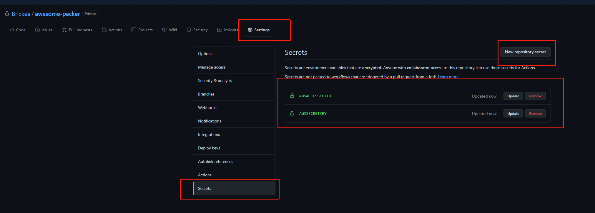

# Day 3 Packer + Github Action 部署虚拟机镜像<!-- omit in toc -->


- [Day 2 回顾](#day-2-回顾)
- [使用 ```Packer``` 配置虚拟机镜像](#使用-packer-配置虚拟机镜像)
  - [安装 Packer](#安装-packer)
  - [创建模板 json](#创建模板-json)
    - [第一部分 variables](#第一部分-variables)
    - [第二部分 builders](#第二部分-builders)
    - [第三部分 provisioners](#第三部分-provisioners)
  - [设计执行脚本 base.sh](#设计执行脚本-basesh)
  - [使用 Packer 本地创建 AMI](#使用-packer-本地创建-ami)
- [Github Action + Packer 自动化创建 AMI](#github-action--packer-自动化创建-ami)
  - [配置 GitHub Action](#配置-github-action)
  - [使用 github secret](#使用-github-secret)
  - [推送代码，触发 GitHub action](#推送代码触发-github-action)

## Day 2 回顾

在 Day 2 中，我们涉及了一下内容

* VPC: 虚拟网络，逻辑上与 AWS 云中的其他虚拟网络隔绝
* Subnet: 子网是 VPC 内的 IP 地址范围
* Internet gateway: 支持 VPC 和 Internet 之间的通信
* Route: 确定将网络流量从 VPC 发送到何处
* Security group: 安全组 充当实例的虚拟防火墙以控制入站和出站流量
* EC2: 我们的虚拟机实例

并且我们创建了自己的 VPC，并在 VPC 中创建了两个子网 Alpha 和 Beta。

之后，我们创建了网关，并将这个网关和之前创建的 VPC 相关联

通过创建路由 route 赋予了 子网 Alpha， Beta 和 Internet 之间的通讯能力

最后，通过配置安全组 security group 开放了 22， 8080 端口，并将这个安全组和创建的 EC2 实例相关联。通过 ssh 登录到 EC2 实例，配置 node.js 环境并启动了我们的第一个小网站

接下来，在 Day 3 ，我们将要学习如何使用 Packer 去自动化配置我们的虚拟机镜像，如此一来，我们就不需要再给虚拟机安装固定的环境了

## 使用 ```Packer``` 配置虚拟机镜像

一句话带过： Packer是一个开放源代码工具，可从一个源配置为多个平台创建相同的机器映像。

### 安装 Packer

首先我们[安装 Packer](https://learn.hashicorp.com/tutorials/packer/getting-started-install)

验证安装


### 创建模板 json

配置文件用于定义我们要构建的映像

我们将从创建整个模板开始，然后再简要介绍每个部分。 创建 ami_template.json 并加入以下内容：

```json
{
    "variables": {
        "aws_access_key": "",
        "aws_secret_key": "",
        "aws_region": "",
        "source_ami": "ami-0885b1f6bd170450c",
        "ssh_username": "ubuntu",
        "dev_user_id": "819094020984",
        "prob_user_id":"905242170281",
        "root_user_id": "858189696230"
    },
    "builders": [
        {
            "type": "amazon-ebs",
            "access_key": "{{user `aws_access_key`}}",
            "secret_key": "{{user `aws_secret_key`}}",
            "region": "{{user `aws_region`}}",
            "instance_type": "t2.micro",
            "source_ami": "{{user `source_ami`}}",
            "ssh_username": "{{user `ssh_username`}}",
            "ami_users": ["{{user `dev_user_id`}}","{{user `prob_user_id`}}","{{user `root_user_id`}}"],
            "ami_name": "awesome_{{timestamp}}",
            "ami_description": "Ubuntu AMI for awesome",
            "launch_block_device_mappings": [
                {
                    "device_name": "/dev/sda1",
                    "volume_size": 8,
                    "volume_type": "gp2",
                    "delete_on_termination": true
                }
            ]
        }
    ],
    "provisioners": [
        {
            "type": "shell",
            "scripts": [
                "shell-script/base.sh"
            ],
            "pause_before": "4s"
        }
    ]
}

```

#### 第一部分 variables 

定义了可以在后面使用的变量
> 注：这里你可能对后面变量引用有疑问：为什么一定要加 ```user``` 来使用定义的变量，这个可以看一下packer的[文档](https://www.packer.io/docs/templates/user-variables.html)，里面有解释。变量默认就是这么使用，不加别名就是用 ```user``` 来引用

#### 第二部分 builders 

定义了我们的虚拟机镜像配置

对于
```
"type": "amazon-ebs" 
```
这个类型我们看一下文档解释:
> This is the Amazon EC2 AMI builder that ships with Packer. This builder builds an EBS-backed AMI by launching a source AMI, provisioning on top of that, and re-packaging it into a new AMI.

对于

```
"access_key": "{{user `aws_access_key`}}",
"secret_key": "{{user `aws_secret_key`}}",
```

access_key 和 secret_key 就是对应 AWS 账号下的 Access key ID 和 与其对应的 Access key


对于剩下的都是一些基础的配置

```
"region": "{{user `aws_region`}}",
"instance_type": "t2.micro",
"source_ami": "{{user `source_ami`}}",
"ssh_username": "{{user `ssh_username`}}",
"ami_users": ["{{user `dev_user_id`}}","{{user `prob_user_id`}}","{{user `root_user_id`}}"],
"ami_name": "awesome-{{timestamp}}",
"ami_description": "Ubuntu AMI for awesome",
"launch_block_device_mappings": [
    {
        "device_name": "/dev/sda1",
        "volume_size": 8,
        "volume_type": "gp2",
        "delete_on_termination": true
    }
]
```

```region``` 制定了资源的使用区域

在这里可以看到当前使用的区域，一般来说创建 AMI 的区域一定要和 EC2 的区域保持一致


```instance_type``` 指定了 EC2 实例的类型，网页 console 可以在这里看到，我们使用的是 ```t2.micro```


```source_ami``` 指定了我们构建虚拟机镜像模板的父模板，这里我们使用 Day 1 中提到的 Ubuntu20 基础镜像: ami-0885b1f6bd170450c

```ssh_username``` 指定了之后 ssh 登陆的用户名，也就是这一块：

> ssh -i access_key.pem ```ssh_username```@ip

```ami_users``` 指定了哪些用户可以使用这个镜像，本例子中我将这个镜像共享给了三个用户，这个 account id可以在这里看到


```ami_name``` 指定了 ami 名字，这里有默认的变量 {{timestamp}} 会自动添加当前系统时间戳

```launch_block_device_mappings``` 指定了 ami 的硬盘存储

#### 第三部分 provisioners

这一部分指定了我们镜像在初始化的时候自动执行的脚本，这里我们就可以进行编辑，让镜像自动安装我们想要的环境

```
"provisioners": [
        {
            "type": "shell",
            "scripts": [
                "shell-script/base.sh"
            ],
            "pause_before": "4s"
        }
    ]
```

```type``` 指定了脚本类型

```scripts``` 指定了脚本位置

```pause_before``` 指定了执行脚本前等待时间

### 设计执行脚本 base.sh

在 ```ami_template.json``` 根目录下创建 ```shell-script/base.sh```

```sh
# wait for cloud-init 
# 这一步一定要加，等待我们想要创建的云虚拟机初始化完成后在执行我们想要安装的环境脚本
while [ ! -f /var/lib/cloud/instance/boot-finished ]; do echo 'Waiting for cloud-init...'; sleep 1; done

# update apt-get repo
sudo apt-get update -y

# install java jdk
# 因为之后我们会使用 spring boot 项目，所以让我们的镜像安装 java 环境，默认是 jdk 11
sudo apt-get install -y default-jdk
```

### 使用 Packer 本地创建 AMI

到 ```ami-tempalte.json``` 的根目录下，执行

```sh
packer build \
 -var 'aws_access_key=your access key'\
 -var 'aws_secret_key=your access secret key'\
 -var 'aws_region=your region'\
 ami_template.json 
```

执行了之后


我们会发现 EC2 中多了一个这个东西


这个东西就是在帮助我们创建定制的虚拟机镜像

稍等一会(大概10分钟)，最后去 AMI 下可以查看到我们最新创建的 AMI


> 当时是 2020年12月28日 创建的

## Github Action + Packer 自动化创建 AMI

本地 Packer 创建 AMI 玩完了，我们总想要再懒一点，所以这一次让我们实现 “packer 代码上传至 github 后就能自动触发 AMI 的构建” 这一功能

### 配置 GitHub Action

首先先创一个代码库，比如我创了一个 ```awesome-packer``` 的代码库

然后 clone 下仓库后创建以下文件结构


这里 ```.github/workflows/``` 路径是 GitHub action 默认寻找脚本的位置

在这个路径下创建一个脚本 ```ami.yml```

```yml
# Github action 名称
name: Packer

# 触发器 Trigger
on: 
  push:
    branches: 
      - main # 这里是我只要 push 到 main 分支上就执行 下面的 jobs

# 顺序执行的内容
jobs:
  packer:
  # 使用 ubuntu 作为脚本执行环境
    runs-on: ubuntu-latest
    name: packer

    steps:
      # Checks out a copy of your repository on the ubuntu-latest machine
      # 在GitHub action的 ubuntu 环境里下拉仓库的最新代码
      - name: Checkout Repository
        uses: actions/checkout@v2
    
      # validate packer ami templates
      # 检查 packer ami 脚本是否有错误
      - name: Validate Template
        uses: operatehappy/packer-github-actions@master
        with:
          command: validate
          arguments: -syntax-only
          target: ami_template.json

      # 执行 Packer
      - name: Packer AMI Build
        uses: zmingxie/packer-ami-builder@master
        with:
          packerArgs: 'build ami_template.json'
          workDir: '.'
        env:
          AWS_ACCESS_KEY_ID: ${{ secrets.AWSACCESSKEYID }} # 这里用到了 github secret，接下来详解
          AWS_SECRET_ACCESS_KEY: ${{ secrets.AWSSECRETKEY }}
          AWS_DEFAULT_REGION: us-east-1
```

### 使用 github secret

你已经注意到了在 GitHub action 脚本中，我们并没有在最后执行 packer 的时候使用明文指定 access key (本地使用 packer 的时候我们明文指定了！)

这个是因为如果我们明文指定了的话，这部分代码推送到 github 上就会直接暴露你的密钥，所有人都能用你这个密钥对随意修改你的 AWS 资源。

所以这里我们用到了 github secret 这个服务，进入到你的代码库，在这个位置创建如下 secret，名称要和你 ```ami.yml``` 中最后 packer 用到的名称一致

```yml
# 执行 Packer
- name: Packer AMI Build
  uses: zmingxie/packer-ami-builder@master
  with:
    packerArgs: 'build ami_template.json'
    workDir: '.'
  env:
    AWS_ACCESS_KEY_ID: ${{ secrets.AWSACCESSKEYID }} # 就是这个 secrets. 后面的名字
    AWS_SECRET_ACCESS_KEY: ${{ secrets.AWSSECRETKEY }}
    AWS_DEFAULT_REGION: us-east-1
```



也许你也注意到了，在 GitHub action 脚本中引用 GitHub secret 变量的方法：```${{ secrets.变量名}}```

### 推送代码，触发 GitHub action

让我们 try try

先把代码推送到 main 分支上


检查 action 是否正确触发


> 已经执行起来了！

等 GitHub action 结束之后去检查一下 AMI


这里可以看到最新的 AMI 已经被 GitHub action 创建好了


