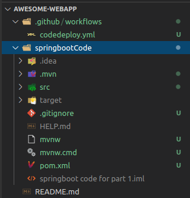
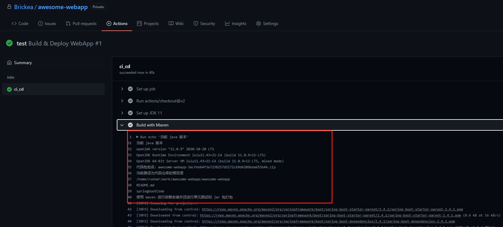
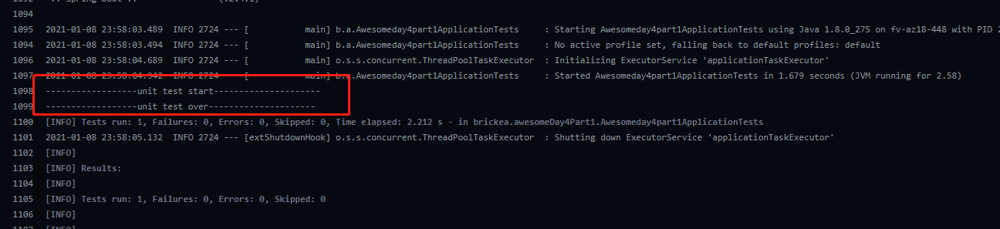
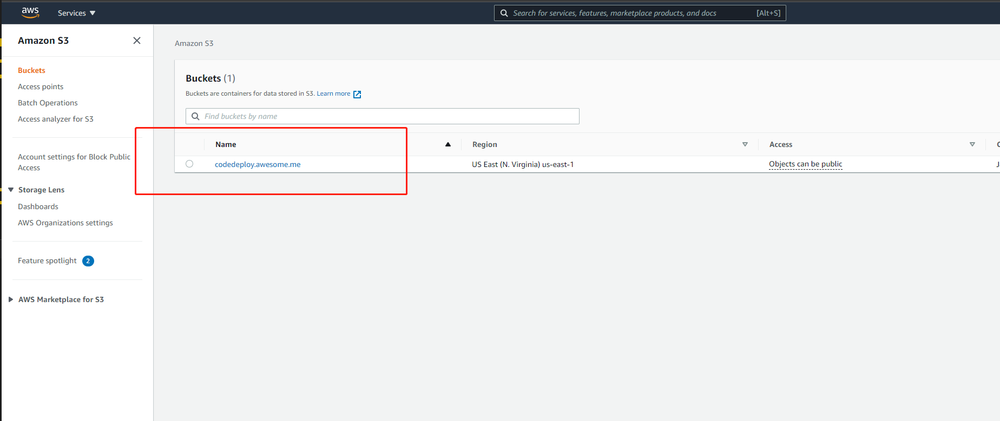
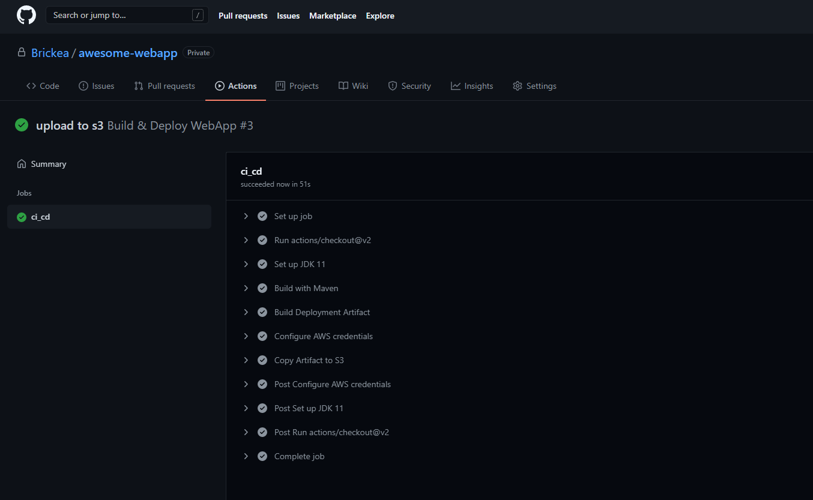
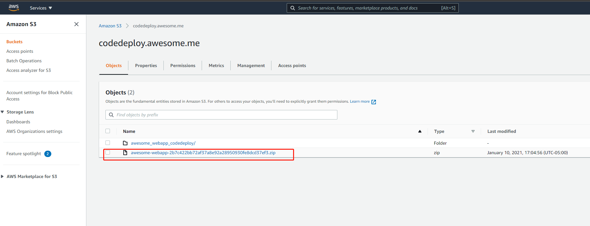
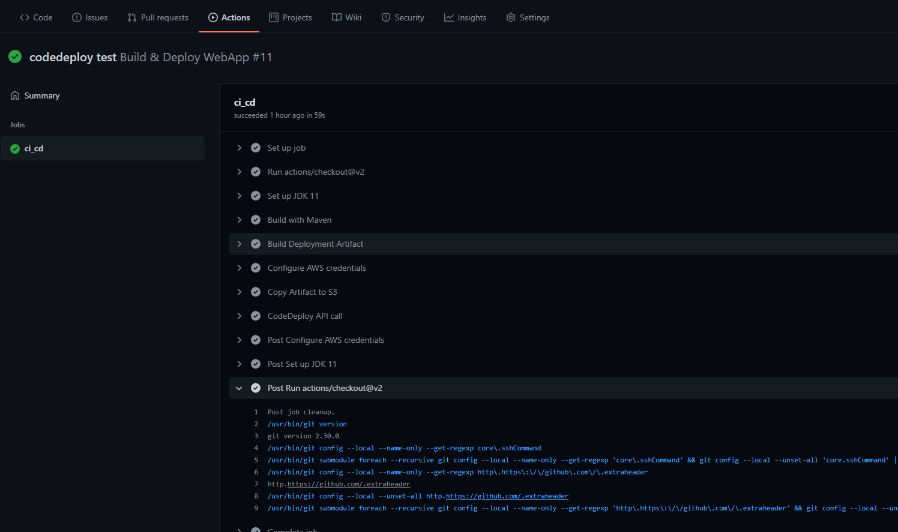
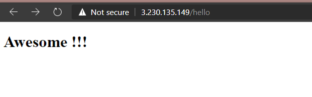

# Day 4 - 7 AWS CodeDeploy + Github Action + Spring Boot 自动化部署代码库最新代码<!-- omit in toc -->

👉[terraform code for part 1](terraform%20code%20for%20part%201/)
👉[springboot code for part 1](springboot%20code%20for%20part%201/)
👉[terraform code for part 2](terraform%20code%20for%20part%202/)
👉[packer code for part 2](packer%20code%20for%20part%202/)
👉[codedeploy code for part 2](codedeploy%20code%20for%20part%202)


- [Day 3 回顾](#day-3-回顾)
- [Part 1 手动实现代码部署步骤](#part-1-手动实现代码部署步骤)
  - [构建云基础设施](#构建云基础设施)
  - [书写简单的 spring boot 用来测试](#书写简单的-spring-boot-用来测试)
  - [手动上传至 EC2](#手动上传至-ec2)
  - [安装对应 java 运行环境，启动 springboot](#安装对应-java-运行环境启动-springboot)
- [Part 2 部署步骤自动化](#part-2-部署步骤自动化)
  - [使用 GitHub action 进行单元测试和打包](#使用-github-action-进行单元测试和打包)
  - [实现自动化前的思考](#实现自动化前的思考)
  - [使用 aws s3 上传代码包](#使用-aws-s3-上传代码包)
    - [使用 terraform 创建 S3 存储](#使用-terraform-创建-s3-存储)
    - [将代码部署包上传到 aws s3 中](#将代码部署包上传到-aws-s3-中)
  - [使用 aws codedeploy 部署 aws s3 中的代码包](#使用-aws-codedeploy-部署-aws-s3-中的代码包)
    - [安装 codedeploy 代理](#安装-codedeploy-代理)
    - [细化权限管理](#细化权限管理)
    - [创建 codedeploy application](#创建-codedeploy-application)
    - [使用 GitHub action 实现部署自动化](#使用-github-action-实现部署自动化)


## Day 3 回顾

在 Day 3 中，我们使用 Packer 创建了自定义虚拟机镜像，其中包含了我们指定安装的程序环境(Java jdk)。然后我们第一次认识了 Github action，并为其编写了 push 所触发的工作流，最终实现了 “推送最新 ami 代码即可触发 packer 的虚拟机镜像创建” 过程。

在 Day 4 中，我们来认识一下 AWS codedeploy 和 AWS S3 存储。最终通过这两个服务实现以下效果：“每当代码推送到 GitHub 上，指定的云虚拟机就会自动部署最新代码”

这一次中我们使用 spring boot 和 maven

回顾上文我们提到的最终效果 “每当代码推送到 GitHub 上，指定的云虚拟机就会自动部署最新代码”，直觉上我们需要做以下的步骤：
* 创建云基础设施
* 书写 spring boot 相关代码
* 将 spring boot 代码推送到 github 上
* 出发 GitHub action 执行一下步骤：
  * 单元测试
  * 打包 spring boot 代码成为 jar 包 (这样做是因为 jar 包可以通过命令 ```java -jar nameOfJar.jar``` 来启动)
  * 将 jar 包上传至指定云虚拟机
  * 在云虚拟机中启动对应 jar 包

在 part 1 中，我们将学习如何手动实现上述代码部署步骤

在 part 2 中，我们将学习如何将上述代码部署步骤自动化

## Part 1 手动实现代码部署步骤

---

### 构建云基础设施

首先我们沿用 Day 2 中构建的云基础设施，创建对应的 EC2、 VPC、 Security Group、 subnet、 Internet Gateway、 route

其中 Security Group 要注意开放 80、22 端口

### 书写简单的 spring boot 用来测试

使用 springboot initializater 创建 springboot 项目

在对应 pom 文件下添加以下依赖

```xml
  <dependencies>
      <dependency>
          <groupId>org.springframework.boot</groupId>
          <artifactId>spring-boot-starter-web</artifactId>
      </dependency>

      <dependency>
          <groupId>org.springframework.boot</groupId>
          <artifactId>spring-boot-starter-test</artifactId>
          <scope>test</scope>
      </dependency>

      <dependency>
          <groupId>org.springframework.boot</groupId>
          <artifactId>spring-boot-starter-thymeleaf</artifactId>
      </dependency>
  </dependencies>
```

之后创建 controller ```hello.java```

```java
package brickea.awesomeDay4Part1.controller;

import org.springframework.stereotype.Controller;
import org.springframework.web.bind.annotation.GetMapping;

@Controller
public class HelloController {
    @GetMapping("/hello")
    public String hello(){
        return "hello";
    }
}

```

在 ```resource``` 下 创建 ```templates``` 目录，并在其中创建对应要渲染的 ```hello.html```

```html
<!doctype html>
<html lang="en">
<head>
    <meta charset="utf-8">

</head>
<body>

    <h1>Awesome !!!</h1>

</body>
</html>
```

在这之后，我们通过使用  maven 进行打包

> 注：如果此时没有安装 maven 需要进行安装 ```sudo apt-get update``` 之后 ``` sudo apt-get install maven```

如果有 maven

在 pom.xml 根目录下执行打包

```sudo mvn package```


最后会在 ```target``` 目录下生成对应的 ```jar``` 包


### 手动上传至 EC2 

使用 scp 命令

```scp -i pem密钥 jar包 ubuntu@ip:~```


> 此时已经上传至 EC2 上了

### 安装对应 java 运行环境，启动 springboot

```sudo apt-get update```

```sudo apt-get install default-jdk```

```java -jar jar包```


此时我们在浏览器访问 ```ec2ip/hello```

就可以看到我们的 awesome 字样了


接下来，我们将学习如何将上述 “单测、打包、上传、启动” 过程自动化

## Part 2 部署步骤自动化

---

### 使用 GitHub action 进行单元测试和打包

我们将会创建 awesome_webapp 代码仓库

在 awesome_webapp 代码仓库的 根目录下创建 ```.github/workflows``` 目录，并在此目录中创建 ```codedeploy.yml``` 文件

之后将我们在 part 1 中创建的 springboot 项目整个放入到这个代码仓库中，修改 springboot 项目文件名为 ```springbootCode```

并在 springboot 项目文件夹 ```springbootCode``` 下的 ```.gitignore``` 内容覆盖为如下内容：

```gitignore
HELP.md
target/
!.mvn/wrapper/maven-wrapper.jar
!**/src/main/**/target/
!**/src/test/**/target/

### STS ###
.apt_generated
.classpath
.factorypath
.project
.settings
.springBeans
.sts4-cache

### IntelliJ IDEA ###
.idea
*.iws
*.iml
*.ipr

### NetBeans ###
/nbproject/private/
/nbbuild/
/dist/
/nbdist/
/.nb-gradle/
build/
!**/src/main/**/build/
!**/src/test/**/build/

### VS Code ###
.vscode/

# Compiled class file
*.class

# Log file
*.log

# BlueJ files
*.ctxt

# Mobile Tools for Java (J2ME)
.mtj.tmp/

# Package Files #
*.jar
*.war
*.nar
*.ear
*.zip
*.tar.gz
*.rar

# virtual machine crash logs, see http://www.java.com/en/download/help/error_hotspot.xml
hs_err_pid*

target/
pom.xml.tag
pom.xml.releaseBackup
pom.xml.versionsBackup
pom.xml.next
release.properties
dependency-reduced-pom.xml
buildNumber.properties
.mvn/timing.properties
# https://github.com/takari/maven-wrapper#usage-without-binary-jar
.mvn/wrapper/maven-wrapper.jar

```

这样我们就不会将工程生成的文件添加到代码库追踪记录中

此时文件目录应如下：



在 ```codedeploy.yml``` 文件中写入以下内容

```yml

# This workflow will build a Java project with Maven
# For more information see: https://help.github.com/actions/language-and-framework-guides/building-and-testing-java-with-maven

name: Build & Deploy WebApp

env: # 这里定义了一些变量名
  ARTIFACT_NAME: awesome-webapp-${{ github.sha }}.zip # 这里用到的 github.sha 会生成一个随机字符串，用来区分每一次构建的代码包

on: # action 出发条件为 master 分支的 push 操作
  push:
    branches:
      - master

jobs:
  ci_cd:

    runs-on: ubuntu-latest # 这里指定了github action 的执行环境

    steps:
    - uses: actions/checkout@v2 # 在 github action 的执行环境中拉取 本仓库最新代码

    - name: Set up JDK 11 # 安装最新 jdk
      uses: actions/setup-java@v1
      with:
        java-version: '11'
    
    - name: Build with Maven # 使用 maven 进行单元测试和 jar 包打包
      run: | # run 后面写的内容，每一行可以理解为在 GitHub action 环境中按照顺序执行的每一行命令 这些命令的执行结果可以在 GitHub action 上看到
        echo '当前 java 版本'
        java -version

        echo '代码包包名：${{env.ARTIFACT_NAME}}'

        echo '当前路径为代码仓库的根目录'
        pwd
        ls

        echo '使用 maven 进行依赖安装并且进行单元测试和 jar 包打包'
        sudo mvn -B clean install --file springbootCode/pom.xml
        sudo mvn -e -B package --file springbootCode/pom.xml
        echo '完成依赖安装以及单元测试和 jar 包打包'

        pwd
        echo '查看 target 文件目录下是否有 jar 包'
        ls -al springbootCode/target

        echo '移动到 target 文件目录下'
        cd springbootCode/target
        pwd
        ls -al

```

之后我们 add 并 push 此代码

调整到 GitHub action 的显示页面，我们可以看到如下内容被执行


> 此时执行了我们预先写在 yml 中的命令


> 在执行 maven 打包过程中会自动运行 springboot 中写好的 unit test，这里我就只是简单写了两行输出 start 和 over


> 最终我们检查一下 GitHub action 运行环境中是否真正在 target 目录下生成了对应的 jar 包，确实已经生成了

到此，我们使用 GitHub action 进行 maven 单测和打包就算是完成了，接下来我们将实现代码包部署并启动的自动化操作

### 实现自动化前的思考

让我们回忆刚刚 part 1 中手动部署代码包和启动的操作

我们首先使用 scp 命令将生成的 jar 包上传到指定的 ec2 中，之后我们再 ssh 登录到对应的 ec2 中，通过 ```java -jar jar包``` 的方式将我们的 spring boot 应用启动

接下来，让我们思考如何通过 GitHub action 来实现上述“上传”的步骤

直觉上来说，我们可以在 GitHub action 中通过 scp 将上一步 “使用 GitHub action 进行单元测试和打包” 中 target 文件夹中生成的 jar 包上传到指定 ec2

但是这样会产生一些问题

* 使用 scp 必须要知道对应 ec2 的 ip
* scp 会使用 pem 密钥文件

pem 文件可以通过 github secret 的方式解决，ip 可以每次出发 GitHub action 前去确认 对应 ip 传输给 GitHub action

但是如我们真的这样做的话，就意味着每次出发 GitHub action 都要手动配置 ip

这样有点脱裤子放屁的感觉，不够自动化

所以接下来我们要使用 aws s3 和 aws codedeploy 这两个服务来实现真正的 “推送代码即测试+部署” 这一操作

**aws s3 一句话带过**就是一个存储服务，你可以把各种东西放到上面，然后他会提供一个外部下载访问的链接

**aws codedeploy 一句话带过**就是代码部署服务，你可以通过配置指定它在那些资源上进行诸如 代码上传，脚本执行等操作

在本次教程中，我们的流程如下

* 本地编辑 springboot 代码
* 通过 git push 到 GitHub 上并出发 GitHub action
* 通过 GitHub action 进行代码单元测试和打包
* 通过 GitHub action 将代码包上传至 s3 存储
* 通过 GitHub action 使用 codedeploy 将 s3 存储中上传的代码部署包部署到指定 ec2 上

### 使用 aws s3 上传代码包

修改 awesome_webapp 中的 GitHub action 工作流如下：

```yml
# This workflow will build a Java project with Maven
# For more information see: https://help.github.com/actions/language-and-framework-guides/building-and-testing-java-with-maven

name: Build & Deploy WebApp

env: # 这里定义了一些变量名
  ARTIFACT_NAME: awesome-webapp-${{ github.sha }}.zip # 这里用到的 github.sha 会生成一个随机字符串，用来区分每一次构建的代码包，防止重名

on: # action 出发条件为 master 分支的 push 操作
  push:
    branches:
      - main

jobs:
  ci_cd:

    runs-on: ubuntu-latest # 这里指定了github action 的执行环境

    steps:
    - uses: actions/checkout@v2 # 在 github action 的执行环境中拉取 本仓库最新代码

    - name: Set up JDK 11 # 安装最新 jdk
      uses: actions/setup-java@v1
      with:
        java-version: '11'
    
    - name: Build with Maven # 使用 maven 进行单元测试和 jar 包打包
      run: | # run 后面写的内容，每一行可以理解为在 GitHub action 环境中按照顺序执行的每一行命令 这些命令的执行结果可以在 GitHub action 上看到
        echo '当前 java 版本'
        java -version

        echo '代码包包名：${{env.ARTIFACT_NAME}}'

        echo '当前路径为代码仓库的根目录'
        pwd
        ls

        echo '使用 maven 进行依赖安装并且进行单元测试和 jar 包打包'
        sudo mvn -B clean install --file springbootCode/pom.xml
        sudo mvn -e -B package --file springbootCode/pom.xml
        echo '完成依赖安装以及单元测试和 jar 包打包'

        pwd
        echo '查看 target 文件目录下是否有 jar 包'
        ls -al springbootCode/target

        echo '移动到 target 文件目录下'
        cd springbootCode/target
        pwd
        ls -al

# ---------以下为新添加的内容------------------
    - name: Build Deployment Artifact # 创建上传到 s3 中的 代码部署包
      run: |
        echo '创建 codedeploy_artifact 目录'
        mkdir codedeploy_artifact
        echo '将对应 jar 包压缩'
        zip -r ${{ env.ARTIFACT_NAME }} springbootCode/target/awesomeday4part1-0.0.1-SNAPSHOT.jar
        ls -al
        echo '将对应压缩包 zip 放入到 codedeploy_artifact 目录'
        mv ${{ env.ARTIFACT_NAME }} codedeploy_artifact/
        ls -al
        echo '进入 codedeploy_artifact 目录进行验证'
        cd codedeploy_artifact
        ls -al

    - name: Configure AWS credentials # 配置 aws cli，指定将要操作的账号
      uses: aws-actions/configure-aws-credentials@v1
      with:
        aws-access-key-id: ${{ secrets.AWSACCESSKEYID }}
        aws-secret-access-key: ${{secrets.AWSSECRETKEY }}
        aws-region: ${{ secrets.AWS_REGION }}

    - name: Copy Artifact to S3 # 将对应 zip 压缩文件上传到 s3 存储中
      run: | # 此时我们并没有创建 s3 存储！！！
        aws s3 sync ./codedeploy_artifact s3://${{ secrets.S3_CODEDEPLOY_BUCKET }}

```

这时候你会发现这里有一个全新的 github secrets 变量 ```S3_CODEDEPLOY_BUCKET```，此时我们并没有创建 s3 存储

接下来我们对我们的 terraform 文件进行修改

#### 使用 terraform 创建 S3 存储

创建 ```8_s3.tf``` 文件并输入以下配置

```go

// 创建 用来进行代码部署的 S3---------------------------------------------
resource "aws_s3_bucket" "awesome_webapp_s3" {
  bucket = "codedeploy.awesome.me" // 这里的命名是有要求的，如果我们将来打算使用的 domain name 是 awesome.me 那么命名必须遵循 bucketName.awesome.me
  acl    = "private"

  force_destroy = true // 无论此 s3 存储是否有内容存入，都允许 terraform 执行 destroy
  // 如果不写这个配置，会导致每一次 apply 之后必须手动清空 s3 之后才能正常执行 terraform destroy

  // 启用加密，对我们使用没有直接影响，只是让这个 s3 存储更安全
  server_side_encryption_configuration {
    rule {
      apply_server_side_encryption_by_default {
        sse_algorithm     = "AES256"
      }
    }
  }

  tags = {
    Name        = "awesome webapp codedeploy s3"
  }
}
```

之后让我们 terraform apply 一下

再登录 aws 网页就能看到我们创建的 s3 bucket 了



#### 将代码部署包上传到 aws s3 中

继本节中创建的 yml

```yml
# This workflow will build a Java project with Maven
# For more information see: https://help.github.com/actions/language-and-framework-guides/building-and-testing-java-with-maven

name: Build & Deploy WebApp

env: # 这里定义了一些变量名
  ARTIFACT_NAME: awesome-webapp-${{ github.sha }}.zip # 这里用到的 github.sha 会生成一个随机字符串，用来区分每一次构建的代码包

on: # action 出发条件为 master 分支的 push 操作
  push:
    branches:
      - main

jobs:
  ci_cd:

    runs-on: ubuntu-latest # 这里指定了github action 的执行环境

    steps:
    - uses: actions/checkout@v2 # 在 github action 的执行环境中拉取 本仓库最新代码

    - name: Set up JDK 11 # 安装最新 jdk
      uses: actions/setup-java@v1
      with:
        java-version: '11'
    
    - name: Build with Maven # 使用 maven 进行单元测试和 jar 包打包
      run: | # run 后面写的内容，每一行可以理解为在 GitHub action 环境中按照顺序执行的每一行命令 这些命令的执行结果可以在 GitHub action 上看到
        echo '当前 java 版本'
        java -version

        echo '代码包包名：${{env.ARTIFACT_NAME}}'

        echo '当前路径为代码仓库的根目录'
        pwd
        ls

        echo '使用 maven 进行依赖安装并且进行单元测试和 jar 包打包'
        sudo mvn -B clean install --file springbootCode/pom.xml
        sudo mvn -e -B package --file springbootCode/pom.xml
        echo '完成依赖安装以及单元测试和 jar 包打包'

        pwd
        echo '查看 target 文件目录下是否有 jar 包'
        ls -al springbootCode/target

        echo '移动到 target 文件目录下'
        cd springbootCode/target
        pwd
        ls -al

# ---------以下为新添加的内容------------------
    - name: Build Deployment Artifact # 创建上传到 s3 中的 代码部署包
      run: |
        echo '创建 codedeploy_artifact 目录'
        mkdir codedeploy_artifact
        echo '将对应 jar 包压缩'
        zip -r ${{ env.ARTIFACT_NAME }} springbootCode/target/awesomeday4part1-0.0.1-SNAPSHOT.jar
        ls -al
        echo '将对应压缩包 zip 放入到 codedeploy_artifact 目录'
        mv ${{ env.ARTIFACT_NAME }} codedeploy_artifact/
        ls -al
        echo '进入 codedeploy_artifact 目录进行验证'
        cd codedeploy_artifact
        ls -al

    - name: Configure AWS credentials # 配置 aws cli，指定将要操作的账号
      uses: aws-actions/configure-aws-credentials@v1
      with:
        aws-access-key-id: ${{ secrets.AWSACCESSKEYID }} # 这里我们使用的 github secret 是 aws 账户的密钥
        aws-secret-access-key: ${{secrets.AWSSECRETKEY }} # aws 账户密钥拥有所有此账户下所有资源的所有操作权限
        aws-region: ${{ secrets.AWS_REGION }}

    - name: Copy Artifact to S3 # 将对应 zip 压缩文件上传到 s3 存储中
        aws s3 sync ./codedeploy_artifact s3://${{ secrets.S3_CODEDEPLOY_BUCKET }}
```

让我们试一下能否真正上传到对应的 s3 存储中

使用 git push 到代码仓库的 main 分支中

查看 GitHub action 的执行状况



查看 s3 里面是不是有了对应的 zip 文件



> 我们可以发现 zip 文件已经上传到对应的 s3 bucket 里面了

### 使用 aws codedeploy 部署 aws s3 中的代码包

对于使用 codedeploy 你可以查看 AWS 的[官方文档](https://docs.aws.amazon.com/zh_cn/codedeploy/latest/userguide/tutorials-windows-deploy-application.html) 来获取更详细的信息

这里我进行简单的概括

想要借助 aws codedeploy 来部署位于 s3 存储中的代码包，我们必须保证

* 部署目的地资源已安装 codedeploy 代理
* 创建对应的部署组。不过，在创建部署组之前，我们需要服务角色 ARN。服务角色是 IAM 角色，该角色授予某个服务代表您执行操作的权限。在这种情况下，服务角色将为 CodeDeploy 提供访问我们的 Amazon EC2 实例的权限，以扩展（读取）其 Amazon EC2 实例标签。

#### 安装 codedeploy 代理

首先我们来处理第一个要求 “部署目的地资源已安装 codedeploy 代理”

还记得我们使用 packer 来创建对应环境的虚拟机镜像吗

在这里我们将通过编辑 packer 来创建一个虚拟机镜像，其中包含以下环境

* java jdk
* codedeploy 代理

接下来，我们修改之前的 packer 代码

将 shell-script 中的 base.sh 更改为以下内容

```sh
# wait for 
while [ ! -f /var/lib/cloud/instance/boot-finished ]; do echo 'Waiting for cloud-init...'; sleep 1; done

sudo apt-get update -y

# install java jdk
sudo apt-get install -y default-jdk

echo "*********************intalling CodeDeploy*********************"
sudo apt-get install ruby -y
# cd /home/ec2-user
wget https://aws-codedeploy-us-east-1.s3.us-east-1.amazonaws.com/latest/install
chmod +x ~/install
sudo ./install auto

# 这样就能保证以这个镜像为蓝本的 ec2 会直接启动 codedeploy 代理
sudo service codedeploy-agent start 
sudo service codedeploy-agent status
echo "*********************install CodeDeploy finish*********************"
```

修改 bash.sh 后，git push 触发 GitHub action 来生成对应虚拟机镜像

然后修改我们 terraform 中 ec2 使用的 ami 镜像为上一步骤中生成的 ami id

接下来，我们来解决第二个要求，也就是

创建对应的部署组。不过，在创建部署组之前，我们需要服务角色 ARN。服务角色是 IAM 角色，该角色授予某个服务代表您执行操作的权限。在这种情况下，服务角色将为 CodeDeploy 提供访问我们的 Amazon EC2 实例的权限，以扩展（读取）其 Amazon EC2 实例标签。

这个是可以通过 terraform 完成配置的

会到之前我们 terraform 工作目录下，创建文件 ```9_codedeploy.tf```并输入以下内容

```go
// 创建部署应用 CodeDeploy Application
resource "aws_codedeploy_app" "webapp_codeDeploy_app" {
  compute_platform = "Server"
  name             = "awesome-webapp"
}

// 创建部署组 CodeDeploy Application Group
resource "aws_codedeploy_deployment_group" "webapp_CD_group" {
  app_name              = aws_codedeploy_app.webapp_codeDeploy_app.name // 使用前面创建的部署应用
  deployment_group_name = "awesome-webapp-deployment"
  service_role_arn      = aws_iam_role.codeDeployService_access_role.arn // 关于这个后文会解释

  deployment_style {
    deployment_type   = "IN_PLACE" // in place 的部署方式就是在哪部署代码，就在哪执行各种操作
  }

  deployment_config_name = "CodeDeployDefault.AllAtOnce"

  auto_rollback_configuration {
    // 部署失败的时候回滚
    enabled = true
    events  = ["DEPLOYMENT_FAILURE"]
  }

  // 通过 tag 寻找要部署的 ec2
   ec2_tag_set {
    ec2_tag_filter {
      key   = "Name"
      type  = "KEY_AND_VALUE"
      value = "my-first-ec2-instance"
    }
  }

  depends_on = [aws_codedeploy_app.webapp_codeDeploy_app]
}
```

#### 细化权限管理

让我们先回顾一下自动化部署代码的步骤

* 使用 GitHub action 单测+打包 spring boot 项目
* 使用 GitHub action 将打包后的 spring boot 项目上传至 S3 存储
* 使用 GitHub action 调用 codedeploy API 将对应 S3 中的代码部署包部署到对应的 EC2 中

对于第二步，我们是通过在 GitHub action 中配置 AWS cli 来实现上传 S3 存储的操作的，也就是 ```codedeploy.yml``` 的以下代码

```yml
    - name: Configure AWS credentials # 配置 aws cli，指定将要操作的账号
      uses: aws-actions/configure-aws-credentials@v1
      with:
        aws-access-key-id: ${{ secrets.AWSACCESSKEYID }} # 这里我们使用的 github secret 是 aws 账户的密钥
        aws-secret-access-key: ${{secrets.AWSSECRETKEY }} # aws 账户密钥拥有所有此账户下所有资源的所有操作权限
        aws-region: ${{ secrets.AWS_REGION }}

    - name: Copy Artifact to S3 # 将对应 zip 压缩文件上传到 s3 存储中
      run: | 
        aws s3 sync ./codedeploy_artifact s3://${{ secrets.S3_CODEDEPLOY_BUCKET }}
```

这里为了更清晰的解释 IAM 的作用，我们先来详细理解一下上面的 yml 代码

首先第一部分 ```Configure AWS credentials``` 是配置 GitHub action 上的 aws cli (just a reminder aws cli 就是 [aws 命令行界面](https://aws.amazon.com/cn/cli/)) 配置好了之后我们就可以使用 ```aws 其他各种命令``` 来操作对应账户上的 aws 资源

之前，我们配置的 aws access key 是账号本身的，也就是在以下位置：


> 这个 secret key 拥有该账户的所有资源的所有使用权

显而易见这样子的做法会导致潜在的安全问题，最佳实践应该是只赋予对应操作的最低权限（用到什么权限赋予什么权限）

所以在这里我们将使用 [IAM](https://docs.aws.amazon.com/IAM/latest/UserGuide/introduction.html?icmpid=docs_iam_console) 来划分对应权限

一句话带过 IAM (Identity and Access Management) 就是它可以管理相关 AWS 账户下的各种权限。在这里我们将会借助 IAM 来创建相应的权限

所以依据权限的最佳实践，我们想要让 GitHub action 上传文件到 S3 存储，我们应该让 GitHub action 里面的 aws cli 拥有上传文件到指定 S3 的权限

做法就是，先在 aws 的 IAM 下创建一个名为 ```cicd``` 的子权限用户


> 这里要勾选 Programmatic access，这样才能通过 secret access key 来配置 aws cli

然后剩下的步骤就按照默认就好，不用赋予任何权限或者将这个用户分配到任何组里面

然后我们点击刚刚创建的 cicd 用户，为其创建一个 access key


> 你应该已经意识到了，这个 access key 将会被配置在 GitHub secret 中

接下来，让我们用 terraform 为其分配对应的权限

在我们的 terraform 根目录下创建 ```10_iam_role.tf``` 文件

添加以下内容

```go
// GH-Upload-To-S3 Policy for GitHub Actions to Upload to AWS S3
// Get Put List codedeploy.awesome.me
// 这里我们分配 get put list 三个权限给 cicd
resource "aws_iam_policy" "s3_ghUpLoad_role_policy" {
  // 创建 policy
  name        = "GH_Upload_To_S3"
  policy = file("policy/cicd_upload_s3_file.json") // 随后就创建这个 policy
}

resource "aws_iam_user_policy_attachment" "s3_ghUpLoad_user_policy_attach" {
  // 将 policy 赋予给 cicd 用户
  user       = "cicd"
  policy_arn = aws_iam_policy.s3_ghUpLoad_role_policy.arn
}
```

之后在 terraform 根目录下 创建 policy 目录，并在 policy 目录中创建 ```cicd_upload_s3_file.json``` 文件，书写以下内容

此时我们不只是添加了上传文件的权限(s3:PutObject)，我们还添加了下载和浏览文件的权限(Get 和 List)

```json
{
    "Version": "2012-10-17",
    "Statement": [
        {
            "Effect": "Allow",
            "Action": [
                "s3:PutObject",
                "s3:Get*",
                "s3:List*"
            ],
            "Resource": [
                "arn:aws:s3:::codedeploy.awesome.me",
                "arn:aws:s3:::codedeploy.awesome.me/*"
            ]
        }
    ]
}
```

顾名思义，action 赋予了对应 put get list 权限，resource 指定了对应的 aws 资源，在这里也就是前面我们创建的 S3 存储 codedeploy.awesome.me

接下来，修改 webapp 中 ```codedeploy.yml``` 文件中的 github secret

```yml
# This workflow will build a Java project with Maven
# For more information see: https://help.github.com/actions/language-and-framework-guides/building-and-testing-java-with-maven

name: Build & Deploy WebApp

env: # 这里定义了一些变量名
  ARTIFACT_NAME: awesome-webapp-${{ github.sha }}.zip # 这里用到的 github.sha 会生成一个随机字符串，用来区分每一次构建的代码包
  CODEDEPLOY_APPLICATION_NAME: awesome-webapp
  CODEDEPLOY_APPLICATION_DEPLOYMENT_GROUP_NAME: awesome-webapp-deployment

on: # action 出发条件为 master 分支的 push 操作
  push:
    branches:
      - main

jobs:
  ci_cd:

    runs-on: ubuntu-latest # 这里指定了github action 的执行环境

    steps:
    - uses: actions/checkout@v2 # 在 github action 的执行环境中拉取 本仓库最新代码

    - name: Set up JDK 11 # 安装最新 jdk
      uses: actions/setup-java@v1
      with:
        java-version: '11'
    
    - name: Build with Maven # 使用 maven 进行单元测试和 jar 包打包
      run: | # run 后面写的内容，每一行可以理解为在 GitHub action 环境中按照顺序执行的每一行命令 这些命令的执行结果可以在 GitHub action 上看到
        echo '当前 java 版本'
        java -version

        echo '代码包包名：${{env.ARTIFACT_NAME}}'

        echo '当前路径为代码仓库的根目录'
        pwd
        ls

        echo '使用 maven 进行依赖安装并且进行单元测试和 jar 包打包'
        sudo mvn -B clean install --file springbootCode/pom.xml
        sudo mvn -e -B package --file springbootCode/pom.xml
        echo '完成依赖安装以及单元测试和 jar 包打包'

        pwd
        echo '查看 target 文件目录下是否有 jar 包'
        ls -al springbootCode/target

        echo '移动到 target 文件目录下'
        cd springbootCode/target
        pwd
        ls -al

# ---------以下为新添加的内容------------------
    - name: Build Deployment Artifact # 创建上传到 s3 中的 代码部署包
      run: |
        echo '创建 codedeploy_artifact 目录'
        mkdir codedeploy_artifact
        echo '将对应 jar 包压缩'
        zip -r ${{ env.ARTIFACT_NAME }} springbootCode/target/awesomeday4part1-0.0.1-SNAPSHOT.jar 
        ls -al
        echo '将对应压缩包 zip 放入到 codedeploy_artifact 目录'
        mv ${{ env.ARTIFACT_NAME }} codedeploy_artifact/
        ls -al
        echo '进入 codedeploy_artifact 目录进行验证'
        cd codedeploy_artifact
        ls -al

    - name: Configure AWS credentials
      uses: aws-actions/configure-aws-credentials@v1
      with:
        aws-access-key-id: ${{ secrets.CICD_ACCESS_KEY_ID }}
        aws-secret-access-key: ${{secrets.CICD_ACCESS_KEY }}
        aws-region: ${{ secrets.AWS_REGION }}

    - name: Copy Artifact to S3
      run: |
        aws s3 sync ./codedeploy_artifact s3://${{ secrets.S3_CODEDEPLOY_BUCKET }}
```

之后，让我们先执行 terraform apply 来生成对应 cicd 操作权限

再在 webapp 仓库中使用 git action 上传代码部署包

查看是否成功：


> 成功

到此，对于自动化代码部署的三步：

* 使用 GitHub action 单测+打包 spring boot 项目
* 使用 GitHub action 将打包后的 spring boot 项目上传至 S3 存储
* 使用 GitHub action 调用 codedeploy API 将对应 S3 中的代码部署包部署到对应的 EC2 中

我们已经解决的前两步

#### 创建 codedeploy application

第三步和第二步类似，需要有相关的 aws 资源和对应的操作权限才可以进行

对于第三步，我们配置的资源如下

* AWS codedeploy application 用来实际进行部署

对于第三步，我们需要配置的权限如下

* 依据创建 AWS codedeploy application 的文档，该 application 需要有 ```AWSCodeDeployRole``` 权限
* GitHub action 需要有调用 codedeploy 部署的权限
* GitHub action 需要有操作 EC2 的权限
* 对应的 EC2 应有下载指定 S3 存储中文件的权限

对于配置 AWS codedeploy application

我们先创建他需要的 ```AWSCodeDeployRole``` 权限

在我们的 ```10_iam_role.tf``` 添加这个 role，依据文档，创建 role 的时候需要指定这个 role 使用者是什么 aws 服务(assume_role)，对于我们的 codedeploy application，就是 codedeploy 服务

让我们在 policy 目录下创建 ```codedeploy_application_role_assume.json```

```json
{
    "Version": "2012-10-17",
    "Statement": [
      {
        "Sid": "",
        "Effect": "Allow",
        "Principal": {
          "Service": "codedeploy.amazonaws.com"
        },
        "Action": "sts:AssumeRole"
      }
    ]
  }
```

再在 ```10_iam_role.tf``` 中创建这个 role

```go
// codedeploy service role for creating codedeploy application
resource "aws_iam_role" "codeDeployService_access_role" {
  name = "CodeDeployServiceRole"

  assume_role_policy = file("policy/codedeploy_application_role_assume.json")
}

// AWSCodeDeployPolicy attach to role for creating codedeploy application
resource "aws_iam_role_policy_attachment" "AWSCodeDeployRole" {
  policy_arn = "arn:aws:iam::aws:policy/service-role/AWSCodeDeployRole" // 通过文档得知 AWSCOdedeployRole 的 arn
  role       = aws_iam_role.codeDeployService_access_role.name
}
```

接下来创建对应的 codedeploy application

创建 ```9_codedeploy.tf```

```go
// CodeDeploy Application
resource "aws_codedeploy_app" "avs_codeDeploy_app" {
  compute_platform = "Server"
  name             = "awesome-codedeploy"
}

// CodeDeploy Application Group
// 有创建了 group 是因为 查询文档发现 codedeploy application 必须依托于一个 codedeploy group
resource "aws_codedeploy_deployment_group" "avs_CD_group" {
  app_name              = aws_codedeploy_app.avs_codeDeploy_app.name
  deployment_group_name = "awesome-deployment"
  service_role_arn      = aws_iam_role.codeDeployService_access_role.arn // 这里填写上面我们创建的 role 的 arn

  deployment_style {
    deployment_type   = "IN_PLACE"
  }

  deployment_config_name = "CodeDeployDefault.AllAtOnce"

  auto_rollback_configuration {
    enabled = true
    events  = ["DEPLOYMENT_FAILURE"]
  }

  ec2_tag_set {
    ec2_tag_filter {
      key   = "Name"
      type  = "KEY_AND_VALUE"
      value = "my-first-ec2-instance" // 此处书写我们想要部署的 ec2 名字
    }
  }
}
```

对于配置 GitHub action 调用 codedeploy 部署的权限，我们在 policy 目录下创建 ```cicd_call_codedeploy.json``` 文件并输入以下内容

* 此处要保证 AWS account ID 和你的账户 ID 保持一致 (红色部分)
* 保证区域和你的其他资源区域一致 (蓝色区域)
* 保证 codedeploy 的 application 名称和使用 terraform 创建的名称保持一致 (绿色区域，后面会讲到使用 terraform 创建 codedeploy application)


```json
{
    "Version": "2012-10-17",
    "Statement": [
      {
        "Effect": "Allow",
        "Action": [
          "codedeploy:RegisterApplicationRevision",
          "codedeploy:GetApplicationRevision"
        ],
        "Resource": [
          "arn:aws:codedeploy:us-east-1:819094020984:application:awesome-codedeploy"
        ]
      },
      {
        "Effect": "Allow",
        "Action": [
          "codedeploy:CreateDeployment",
          "codedeploy:GetDeployment"
        ],
        "Resource": [
          "*"
        ]
      },
      {
        "Effect": "Allow",
        "Action": [
          "codedeploy:GetDeploymentConfig"
        ],
        "Resource": [
          "arn:aws:codedeploy:us-east-1:819094020984:deploymentconfig:CodeDeployDefault.OneAtATime",
          "arn:aws:codedeploy:us-east-1:819094020984:deploymentconfig:CodeDeployDefault.HalfAtATime",
          "arn:aws:codedeploy:us-east-1:819094020984:deploymentconfig:CodeDeployDefault.AllAtOnce"
        ]
      }
    ]
  }
```

这个 policy 创建完成后，回到 ```10_iam_role.tf```，我们将使用 terraform 将此 policy 分配给 cicd 用户

添加以下内容

```go
// GH-Code-Deploy Policy for GitHub Actions to Call CodeDeploy
resource "aws_iam_policy" "cicd_deploy_call_codeDeply_policy" {
  name        = "cicd_call_codedeploy_policy"
  
  policy = file("policy/cicd_call_codedeploy.json")
}

resource "aws_iam_user_policy_attachment" "gh_code_deploy_call_codeDeply_user_policy_attach" {
  user       = "cicd"
  policy_arn = aws_iam_policy.cicd_deploy_call_codeDeply_policy.arn
}
```

对于配置 GitHub action 操作 EC2 的权限

我们在 policy 中创建 ```cicd_ec2.json``` 文件并输入以下内容

```json
{
    "Version": "2012-10-17",
    "Statement": [
      {
        "Effect": "Allow",
        "Action": [
          "ec2:AttachVolume",
          "ec2:AuthorizeSecurityGroupIngress",
          "ec2:CopyImage",
          "ec2:CreateImage",
          "ec2:CreateKeypair",
          "ec2:CreateSecurityGroup",
          "ec2:CreateSnapshot",
          "ec2:CreateTags",
          "ec2:CreateVolume",
          "ec2:DeleteKeyPair",
          "ec2:DeleteSecurityGroup",
          "ec2:DeleteSnapshot",
          "ec2:DeleteVolume",
          "ec2:DeregisterImage",
          "ec2:DescribeImageAttribute",
          "ec2:DescribeImages",
          "ec2:DescribeInstances",
          "ec2:DescribeInstanceStatus",
          "ec2:DescribeRegions",
          "ec2:DescribeSecurityGroups",
          "ec2:DescribeSnapshots",
          "ec2:DescribeSubnets",
          "ec2:DescribeTags",
          "ec2:DescribeVolumes",
          "ec2:DetachVolume",
          "ec2:GetPasswordData",
          "ec2:ModifyImageAttribute",
          "ec2:ModifyInstanceAttribute",
          "ec2:ModifySnapshotAttribute",
          "ec2:RegisterImage",
          "ec2:RunInstances",
          "ec2:StopInstances",
          "ec2:TerminateInstances"
        ],
        "Resource": "*"
      }
    ]
  }
```

这个 policy 创建完成后，回到 ```10_iam_role.tf```，我们将使用 terraform 将此 policy 分配给 cicd 用户

添加以下内容

```go
// Give access to github for operating the ec2
resource "aws_iam_policy" "cicd_ec2_role_policy" {
  name        = "cicd_ec2_role_policy"
  policy = file("policy/cicd_ec2.json")
}

resource "aws_iam_user_policy_attachment" "cicd_ec2_policy_attach" {
  user       = "cicd"
  policy_arn = aws_iam_policy.cicd_ec2_role_policy.arn
}
```

对于配置对应的 EC2 下载指定 S3 存储中文件的权限

这里和配置 cicd 用户权限有些不同，这里我们是希望把对应的 policy 赋予给 ec2。查阅 terraform 创建 ec2 的文档得知，policy 不能直接赋予给 ec2，而是需要 ```aws_iam_instance_profile``` 作为载体，整个 policy 赋予给 ec2 的流程如下：创建policy -> 赋予给iam_role -> 将iam_role赋予给iam_instance_profile -> 将profile赋予给ec2

让我们来完成这个流程

先创建 "下载指定 S3 存储中文件的权限" 的 policy，在 policy 目录下创建 ```ec2_codedeploy_s3.json```

```json
{
    "Version": "2012-10-17",
    "Statement": [
        {
            "Effect": "Allow",
            "Action": [
                "s3:Get*",
                "s3:List*"
            ],
            "Resource": [
                "arn:aws:s3:::codedeploy.awesome.me",
                "arn:aws:s3:::codedeploy.awesome.me/*"
            ]
        }
    ]
}
```

回到 ```10_iam_role.tf```，创建这个 policy

```go
// Get List codedeploy.awesome.me
resource "aws_iam_policy" "s3_codeDeply_role_policy" {
  name        = "EC2_access_S3_codedeploy_policy"

  policy = file("policy/ec2_codedeploy_s3.json")
}
```

接下来创建包含此 policy 的 role

查阅 aws 文档发现创建 role 的时候需要指定 assume role，这个东西描述了这个 role 的使用者是什么 aws 服务，这里我们的role 使用者为 ec2，所以我们在 policy 目录下创建 ```ec2_codedeploy_s3_role_assume.json```文件

```json
{
    "Version": "2012-10-17",
    "Statement": [
      {
        "Action": "sts:AssumeRole",
        "Principal": {
          "Service": "ec2.amazonaws.com"
        },
        "Effect": "Allow",
        "Sid": ""
      }
    ]
  } 
```

回到 ```10_iam_role.tf```，创建这个 role 并将之前 "下载指定 S3 存储中文件的权限" 的 policy 赋给他

```go
// codedeploy s3 access roles for ec2 instance
resource "aws_iam_role" "ec2_codedeploy_s3_access_role" {
  name = "ec2_codedeploy_s3_access_role"

  assume_role_policy = file("policy/ec2_codedeploy_s3_role_assume.json")
}

resource "aws_iam_role_policy_attachment" "s3_codeDeply_role_policy_attach" {
  role       = aws_iam_role.ec2_codedeploy_s3_access_role.name // attach to role EC2-AVS
  policy_arn = aws_iam_policy.s3_codeDeply_role_policy.arn // Policy CodeDeploy-EC2-S3

}
```

此时，我们已经有了装载有 "下载指定 S3 存储中文件的权限" policy 的 role

按照流程，我们来创建可以赋给 ec2 的 profile

在 ```10_iam_role.tf```，创建这个 profile

```go
//*********************************************************************************\
// User profile for ec2 instance
resource "aws_iam_instance_profile" "ec2_codedeploy_s3_access_profile" {
  name = "ec2_codedeploy_s3_access_profile"
  role = aws_iam_role.ec2_codedeploy_s3_access_role.name
}
```

并将这个 profile 赋给我们的 ec2

回到```7_ec2.tf```

给我们的 first instance 添加 profile

```go
resource "aws_instance" "my_first_ec2_instance" {

    ami = "ami-077e9a928f0a740e3" 

    instance_type = "t2.micro" # 使用我们之前选的 instance type

    vpc_security_group_ids = [aws_security_group.my_first_ec2_security_group.id] # 使用我们创建的 安全组 注意这里 "aws_security_group." 后面接的名字是之前写的那个

    key_name = "awesome_terraform_aws" # 使用我们上一节中创建的 key pair

    // 添加这一行*****************************************************************************
    iam_instance_profile = aws_iam_instance_profile.ec2_codedeploy_s3_access_profile.name
    // **************************************************************************************

    subnet_id = aws_subnet.my_subnet_alpha.id

    associate_public_ip_address = true

    tags = {
        Name = "my-first-ec2-instance"
    }
}
```

此时，如果你之前已经 terraform apply 创建过没有 profile 的 ec2，此时需要先 destroy 再 apply，因为这个 profile 不能通过 update 的方式添加到已经创建过的 ec2 中

到此，和自动化部署的相关资源和权限已创建完毕

#### 使用 GitHub action 实现部署自动化

接下来我们修改 webapp 中 ```codedeploy.yml``` 文件，使用 GitHub action 来调用 codedeploy

```yml
# This workflow will build a Java project with Maven
# For more information see: https://help.github.com/actions/language-and-framework-guides/building-and-testing-java-with-maven

name: Build & Deploy WebApp

env: # 这里定义了一些变量名
  ARTIFACT_NAME: awesome-webapp-${{ github.sha }}.zip # 这里用到的 github.sha 会生成一个随机字符串，用来区分每一次构建的代码包

  # 添加以下代码*****************************************************************************
  CODEDEPLOY_APPLICATION_NAME: awesome-codedeploy
  CODEDEPLOY_APPLICATION_DEPLOYMENT_GROUP_NAME: awesome-deployment
  # ****************************************************************************************

on: # action 出发条件为 master 分支的 push 操作
  push:
    branches:
      - main

jobs:
  ci_cd:

    runs-on: ubuntu-latest # 这里指定了github action 的执行环境

    steps:
    - uses: actions/checkout@v2 # 在 github action 的执行环境中拉取 本仓库最新代码

    - name: Set up JDK 11 # 安装最新 jdk
      uses: actions/setup-java@v1
      with:
        java-version: '11'
    
    - name: Build with Maven # 使用 maven 进行单元测试和 jar 包打包
      run: | # run 后面写的内容，每一行可以理解为在 GitHub action 环境中按照顺序执行的每一行命令 这些命令的执行结果可以在 GitHub action 上看到
        echo '当前 java 版本'
        java -version

        echo '代码包包名：${{env.ARTIFACT_NAME}}'

        echo '当前路径为代码仓库的根目录'
        pwd
        ls

        echo '使用 maven 进行依赖安装并且进行单元测试和 jar 包打包'
        sudo mvn -B clean install --file springbootCode/pom.xml
        sudo mvn -e -B package --file springbootCode/pom.xml
        echo '完成依赖安装以及单元测试和 jar 包打包'

        pwd
        echo '查看 target 文件目录下是否有 jar 包'
        ls -al springbootCode/target

        echo '移动到 target 文件目录下'
        cd springbootCode/target
        pwd
        ls -al

    - name: Build Deployment Artifact # 创建上传到 s3 中的 代码部署包
      run: |
        echo '创建 codedeploy_artifact 目录'
        mkdir codedeploy_artifact
        echo '将对应 jar 包压缩'
        zip -r ${{ env.ARTIFACT_NAME }} springbootCode/target/awesomeday4part1-0.0.1-SNAPSHOT.jar codedeploy/*.sh appspec.yml
        ls -al
        echo '将对应压缩包 zip 放入到 codedeploy_artifact 目录'
        mv ${{ env.ARTIFACT_NAME }} codedeploy_artifact/
        ls -al
        echo '进入 codedeploy_artifact 目录进行验证'
        cd codedeploy_artifact
        ls -al

    - name: Configure AWS credentials
      uses: aws-actions/configure-aws-credentials@v1
      with:
        aws-access-key-id: ${{ secrets.CICD_ACCESS_KEY_ID }}
        aws-secret-access-key: ${{secrets.CICD_ACCESS_KEY }}
        aws-region: ${{ secrets.AWS_REGION }}

    - name: Copy Artifact to S3
      run: |
        aws s3 sync ./codedeploy_artifact s3://${{ secrets.S3_CODEDEPLOY_BUCKET }}

# 添加以下代码*****************************************************************************
    - name: CodeDeploy API call
      run: |
        output=$(aws deploy create-deployment \
        --application-name ${{ env.CODEDEPLOY_APPLICATION_NAME }} \
        --deployment-config-name CodeDeployDefault.OneAtATime \
        --deployment-group-name ${{ env.CODEDEPLOY_APPLICATION_DEPLOYMENT_GROUP_NAME }} \
        --s3-location bucket=${{ secrets.S3_CODEDEPLOY_BUCKET }},bundleType=zip,key=${{ env.ARTIFACT_NAME }} \
        --region ${{ secrets.AWS_REGION }} \
        --output json)
        echo $output
        dId=$(echo $output | jq -r '.deploymentId')
        aws deploy wait deployment-successful --deployment-id $dId
# *******************************************************************************************
```

这样之后，在触发了 GitHub action 后，就会使用 cicd 这个 iam 账号的权限来调用 codedeploy api

即将大功告成，最后一步就是修改我们的 webapp

依据 aws codedeploy 文档，codedeploy 有一个执行的入口文件，这个文件命名必须为 ```appspec.yml```，这个文件必须被包含在代码部署包(zip)的根目录下。

让我们在 webapp 的根目录下创建这个文件

```yml

version: 0.0
os: linux

# source 指定了了代码部署包中的源文件是哪个，destination 指明了要把这个源文件放到 ec2 的哪个目录下
files:
  - source: ./springbootCode/target/awesomeday4part1-0.0.1-SNAPSHOT.jar
    destination: /home/ubuntu/springbootCode

# 这里的 hooks 指定了在特定代码部署周期中要执行的代码脚本（接下来会创建）
hooks:
  BeforeInstall:
  - location: ./codedeploy/beforeInstall.sh
    timeout: 180
    runas: ubuntu
  AfterInstall:
  - location: ./codedeploy/afterInstall.sh
    timeout: 180
    runas: ubuntu
  ApplicationStart:
  - location: ./codedeploy/applicationStart.sh
    timeout: 180
    runas: ubuntu
  
```

接下来创建代码部署周期中要执行的脚本

先在 webapp 根目录下创建 ```codedeploy``` 目录，并添加以下三个脚本文件

```beforeInstall.sh```

```sh
#!/bin/bash

# 这里我们先移除掉之前代码部署的内容
echo "******************Remove all previous files******************"
if  [ ! -d  "/home/ubuntu/springbootCode/"  ]; then
echo  "No webapp"
else
sudo rm  -rf  /home/ubuntu/springbootCode
fi

```

```applicationStart.sh```

```sh
#!/bin/bash

# 这里我们启动 spring boot
# nohup ... & 是后台运行的意思
# >/dev/null 2>&1 是将运行时产生的 log 抛弃掉，当然你也可以自定义一个自己的 .log 文件来收集相关信息
echo "Start springboot "
sudo nohup java -jar /home/ubuntu/springbootCode/awesomeday4part1-0.0.1-SNAPSHOT.jar >/dev/null 2>&1 &

```

```afterInstall.sh```

```sh
#!/bin/bash

echo "******************Finsh code deployment******************"
```

最后，不要忘记修改 ```codedeploy.yml``` 中打包代码包的内容，我们需要把 ```appspec.yml``` 和 ```codedeploy``` 目录下的脚本都加入到代码部署包中

```yml
    - name: Build Deployment Artifact # 创建上传到 s3 中的 代码部署包
      run: |
        echo '创建 codedeploy_artifact 目录'
        mkdir codedeploy_artifact
        echo '将对应 jar 包压缩'
        echo '将所有相关内容打包***********************************************************************'
        zip -r ${{ env.ARTIFACT_NAME }} springbootCode/target/awesomeday4part1-0.0.1-SNAPSHOT.jar codedeploy/*.sh appspec.yml
        echo '****************************************************************************************'
        ls -al
        echo '将对应压缩包 zip 放入到 codedeploy_artifact 目录'
        mv ${{ env.ARTIFACT_NAME }} codedeploy_artifact/
        ls -al
        echo '进入 codedeploy_artifact 目录进行验证'
        cd codedeploy_artifact
        ls -al

```

最后的 webapp 文件结构应如下


此时，大功告成，让我们来尝试一下

首先先使用 terraform apply

再使用 git push



最后查看 ip/hello 有没有我们的网页



