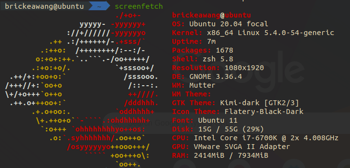
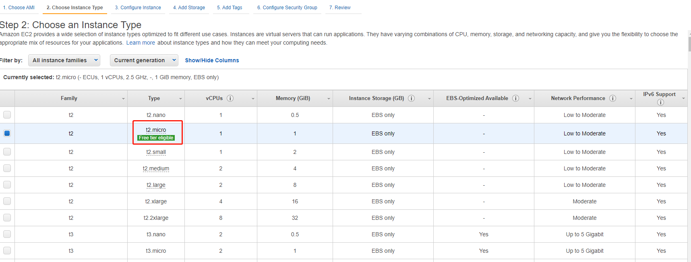
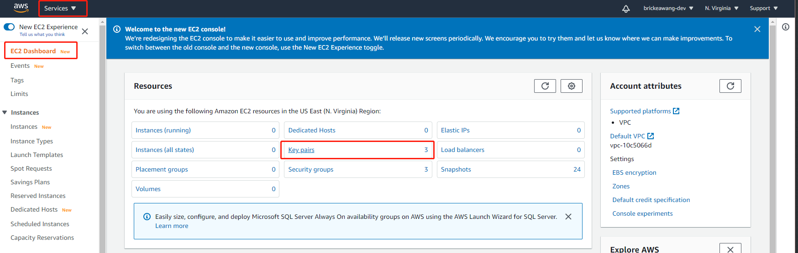
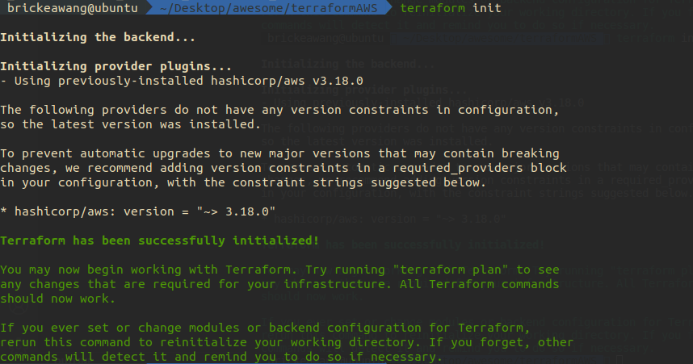
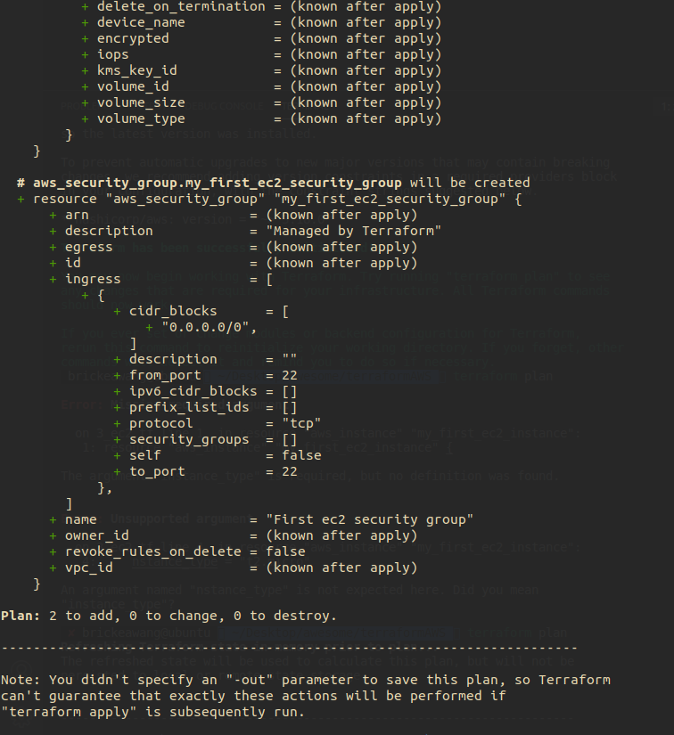
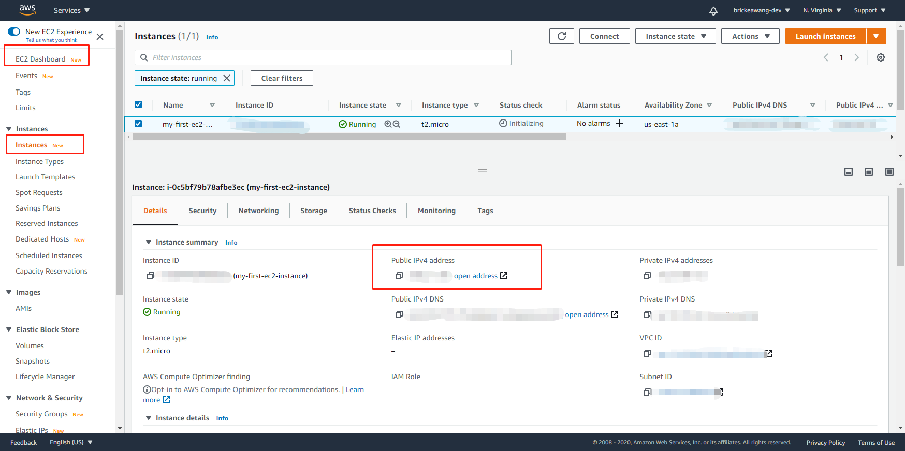

# Terraform 介绍<!-- omit in toc -->


- [什么是 Terraform](#什么是-terraform)
- [安装 Terraform](#安装-terraform)
  - [Step 1 下载对应 zip 文件](#step-1-下载对应-zip-文件)
  - [Step 2 解压 zip 文件](#step-2-解压-zip-文件)
  - [Step 3 配置对应 Path](#step-3-配置对应-path)
  - [Step 4 验证安装](#step-4-验证安装)
  - [几句话](#几句话)
- [使用 Terraform 创建第一个虚拟机实例 EC2](#使用-terraform-创建第一个虚拟机实例-ec2)
  - [创建 AWS EC2 所需要的](#创建-aws-ec2-所需要的)
    - [AWS Command Line Interface](#aws-command-line-interface)
      - [Step 1 下载最新版本的 AWS CLI](#step-1-下载最新版本的-aws-cli)
      - [Step 2 解压 zip](#step-2-解压-zip)
      - [Step 3 安装对应的 aws cli](#step-3-安装对应的-aws-cli)
      - [Step 4 验证安装](#step-4-验证安装-1)
      - [Step 5 配置对应账号](#step-5-配置对应账号)
      - [Step 6 验证账号配置](#step-6-验证账号配置)
    - [Amazon Machine Image(AMI)](#amazon-machine-imageami)
      - [Step 1 选取一个 AMI](#step-1-选取一个-ami)
      - [(Optional) 通过 packer 创建自己的 ami](#optional-通过-packer-创建自己的-ami)
    - [Instance Type](#instance-type)
      - [Step 1 选取一个 instance type](#step-1-选取一个-instance-type)
    - [Network Information(VPC/Subnet)](#network-informationvpcsubnet)
    - [Tags](#tags)
    - [Security Group](#security-group)
    - [Key Pair](#key-pair)
      - [Step 1 前往 ec2 key pair 管理界面](#step-1-前往-ec2-key-pair-管理界面)
      - [Step 2 创建 key pair](#step-2-创建-key-pair)
  - [使用 Terraform 构建相关资源](#使用-terraform-构建相关资源)
    - [Step 1 指定 provider](#step-1-指定-provider)
    - [Step 2 配置 安全组 Security Group](#step-2-配置-安全组-security-group)
    - [Step 3 配置 EC2 实例](#step-3-配置-ec2-实例)
    - [Step 4 执行 terraform 脚本](#step-4-执行-terraform-脚本)

## 什么是 [Terraform](https://www.terraform.io/)

**一句话带过**就是 ```Terrafrom``` 是一种脚本工具，用来自动化构建、管理、配置云供应商的各种产品和服务

我们来看一下官方的介绍

> Terraform is a tool for building, changing, and versioning infrastructure safely and efficiently

```Terraform``` 是用来快速安全构建，修改，版本管理基础设施(infrastructure)的工具。基础设施在这里常指云供应商所提供的各种基础服务(虚拟机，虚拟数据库，虚拟私有子网, etc)。这种管理的过程也被称为 "Managing Infrastructure as Code"

## 安装 Terraform 

在[官网](https://www.terraform.io/downloads.html)下载对应版本

这里用的是 Ubuntu



> 系统配置

### Step 1 下载对应 zip 文件


### Step 2 解压 zip 文件

```
unzip terraform_0.13.5_linux_amd64.zip
```

### Step 3 配置对应 Path

检查当前 ```PATH``` 位置

```
echo $PATH
```

将解压的文件移动到对应目录 ```PATH``` 下

```
mv ~/yourFilePath/terraform /usr/local/bin/
```

### Step 4 验证安装

```
$ terraform --version
Terraform v0.13.5
```

### 几句话

* Terraform 的代码语法是 *[HashiCorp Configuration Language(HCL)](https://www.linode.com/docs/guides/introduction-to-hcl/)*
* 所有 Terrafrom 代码文件扩展名为 ```.tf``` (可不是 tensorflow lol🐷)
* Terraform 是一种显式定义的语言，我们定义需要什么样的基础设施，Terraform 会帮助我们进行对应的创建和配置

## 使用 Terraform 创建第一个虚拟机实例 EC2

Terraform 支持很多云服务供应商，这里我们使用亚马逊的云服务 AWS

我们将会创建一个 *[EC2](https://aws.amazon.com/ec2/?ec2-whats-new.sort-by=item.additionalFields.postDateTime&ec2-whats-new.sort-order=desc)* 实例

### 创建 AWS EC2 所需要的

* AWS Command Line Interface
* Amazon Machine Image(AMI)
* Instance Type
* Network Information(VPC/Subnet)
* Tags
* Security Group
* Key Pair

接下来我们 break it down

---

#### AWS Command Line Interface

为了方便和 AWS 相关资源交互，我们需要向安装 [AWS Cli](https://aws.amazon.com/cli/)

##### Step 1 下载最新版本的 AWS CLI

```
wget "https://awscli.amazonaws.com/awscli-exe-linux-x86_64.zip"
```

##### Step 2 解压 zip

```
unzip yourFilePath/awscli-exe-linux-x86_64.zip
```

##### Step 3 安装对应的 aws cli

```
sudo yourFilePath/aws/install
```

##### Step 4 验证安装

```
$ aws --version
aws-cli/2.1.4 Python/3.7.3 Linux/5.4.0-54-generic exe/x86_64.ubuntu.20
```

##### Step 5 配置对应账号

aws cli 需要有对应账号的 Access keys 来进行相关资源的访问

Access keys 可以在这里找到


记录一下三个内容
* Access keys
* Secret Access Key
* Region name ： region 可以选择你想用的
  

进入命令行配置对应账号

```
aws configure # 直接这么输入会配置 aws cli 的默认账号配置

aws configure --profile=your_profile_name # 建议这么配置，可以明显的知道这个是什么账号
```

##### Step 6 验证账号配置

查看本地配置信息

```
aws configure list-profiles # 即可看到之前配置的账号名称

aws configure --profile=your_profile_name # 可以查看对应的配置内容，不输入新内容只回车就不会修改，如果要修改配置直接输入新的值回车即可
```

---

#### Amazon Machine Image(AMI)

```AMI``` 就是用来运行 EC2 实例的操作系统镜像

##### Step 1 选取一个 AMI


> 这里直接选用 AWS 提供的 ami-0885b1f6bd170450c，注：这里截图是 AWS 网站控制台，我们只需关注 AMI id 即可，截图这个只是为了方便解释，后面我们会用 terraform 来创建相关资源而不用 AWS 网站

##### (Optional) 通过 packer 创建自己的 ami

使用 [Packer](https://www.packer.io/) 可以自定义 AMI 的环境，像是预装对应的 jdk 或者数据库等等

---

#### Instance Type



> 在 AWS 网站上可以查看到的 instance type 信息，同 AMI 我们只需记住 instance type 的名字即可

##### Step 1 选取一个 instance type

实例类型就是每一个 EC2 实例所拥有的配置信息，像是 CPU 内存 I/O 等等

本次我们使用 ```t2.micro``` 类型 (单核CPU, 1GB 内存)

#### Network Information(VPC/Subnet)

[Virtual Private Cloud](https://aws.amazon.com/vpc/) 就是对应账号所拥有的一块虚拟网络区域，可以理解成为虚拟子网。在这个子网里的资源可以拥有自己的子网 ip。 这样方便在同一 VPC 内的资源通过子网互相通讯

---

#### Tags

[Tag](https://docs.aws.amazon.com/zh_cn/AWSEC2/latest/UserGuide/Using_Tags.html) 就是帮助名命和区分 AWS 资源的

---

#### Security Group

[Security Group](https://docs.aws.amazon.com/zh_cn/AWSEC2/latest/UserGuide/ec2-security-groups.html) 安全组相当于是虚拟防火墙，其可以规定特定 ip 的特定端口开放和关闭，用来控制实例之间的数据流

---

#### Key Pair

[Key Pair](https://docs.aws.amazon.com/general/latest/gr/aws-sec-cred-types.html#key-pairs) 密钥可以用来远程登陆实例

##### Step 1 前往 ec2 key pair 管理界面



> 在这里可以管理 Key Pair

##### Step 2 创建 key pair

* key pair 的名字需要记住
* 密钥的 file format 选择 pem 类型，用来后面 ssh 登录实例

### 使用 Terraform 构建相关资源

[Terraform for AWS](https://registry.terraform.io/providers/hashicorp/aws/latest/docs) 的文档

回顾上一节中的资源内容

* AWS Command Line Interface
* Amazon Machine Image(AMI): ami-0885b1f6bd170450c
* Instance Type: t2.micro
* Network Information(VPC/Subnet): Default
* Tags
* Security Group
* Key Pair

#### Step 1 指定 provider

在工作目录下创建 ```1_provider.tf``` 文件

我们使用的是 aws 的服务，指定他，并且我们也要指定是哪个 aws 账号

```t
provider "aws"{
    region = "us-east-1" # 这里可以选你想用的 region
    profile = "your profile name" # 这里输入你 aws cli 配置的 profile name
}
```

#### Step 2 配置 安全组 Security Group

在工作目录下创建 ```2_security_group.tf``` 文件

就像上一节说到的，安全组可以管理流，为了可以远程登录，我们需要开放 ```22``` 端口

在这里我们不指定 VPC 就会使用 Default VPC

```t
resource "aws_security_group" "my_first_ec2_security_group" {
    
    name = "First ec2 security group"

    ingress {
        from_port   = 22
        to_port     = 22
        protocol    = "tcp"
        cidr_blocks = ["0.0.0.0/0"]
  }
}
```

#### Step 3 配置 EC2 实例

在工作目录下创建 ```3_ec2.tf```文件

```t
resource "aws_instance" "my_first_ec2_instance" {

    ami = "ami-0885b1f6bd170450c" # 使用之前我们选的 ubuntu 20 ami id

    instance_type = "t2.micro" # 使用我们之前选的 instance type

    vpc_security_group_ids = [aws_security_group.my_first_ec2_security_group.id] # 使用我们创建的 安全组 注意这里 "aws_security_group." 后面接的名字是之前写的那个

    key_name = "your key pair name" # 使用我们上一节中创建的 key pair

    tags = {
        Name = "my-first-ec2-instance"
    }
}
```

#### Step 4 执行 terraform 脚本

在工作目录下打开命令行

初始化 terraform 执行环境

```
terraform init
```



查看当前脚本会造成什么影响

```
terraform plan
```



应用当前脚本创建资源

```
terraform apply
```

在后面的提示里面输入 yes

去 AWS EC2 管理台查看公共 ip



通过 ssh 登录虚拟机

登陆之前需要确认 .pem 文件的权限是 600

[对于文件权限，可以看看这里](https://blog.csdn.net/u013197629/article/details/73608613)

```
chmod 600 your_key_pair_name.pem
```

```
ssh -i your_key_pair_name.pem ubuntu@your_public_ip
```

即可登陆成功！

到此为止，我们已经成功使用 terraform 创建了 ec2 虚拟机实例

并且通过配置对应的安全组开放了用来远程登陆的 22 端口

最后成功 ssh 远程登陆上了虚拟实例

