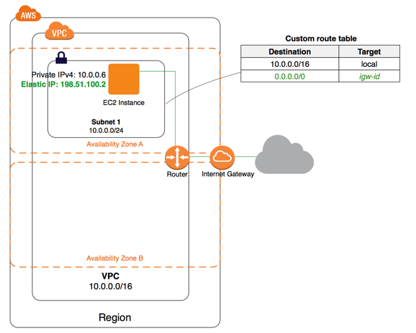

# EC2 VPC Security Group 部署第一个网站 <!-- omit in toc -->

👉[本 Day 代码](terraform%20code/)


- [Day 1 回顾](#day-1-回顾)
- [VPC 介绍](#vpc-介绍)
  - [Subnet 子网和 VPC](#subnet-子网和-vpc)
  - [Route 路由表](#route-路由表)
  - [Internet Gateway 网关 访问外部互联网](#internet-gateway-网关-访问外部互联网)
    - [举个栗子 - 带有单个公有子网的 VPC](#举个栗子---带有单个公有子网的-vpc)
    - [举个栗子 - 带有公有和私有子网的 VPC](#举个栗子---带有公有和私有子网的-vpc)
- [部署 Node.js 网站](#部署-nodejs-网站)
  - [配置 Infrastructure - VPC](#配置-infrastructure---vpc)
    - [疑问: IP 地址到底是怎么写的](#疑问-ip-地址到底是怎么写的)
    - [疑问: IP 地址最后那个斜杠到底是干什么的](#疑问-ip-地址最后那个斜杠到底是干什么的)
  - [配置 Infrastructure - Subnet](#配置-infrastructure---subnet)
  - [配置 Infrastructure - Internet Gateway](#配置-infrastructure---internet-gateway)
  - [配置 Infrastructure - Route Table](#配置-infrastructure---route-table)
  - [配置 Infrastructure - Security Group](#配置-infrastructure---security-group)
  - [配置 Infrastructure - EC2](#配置-infrastructure---ec2)
  - [测试和实例的链接](#测试和实例的链接)
  - [部署 node.js](#部署-nodejs)
  - [Print Hello World!](#print-hello-world)

## Day 1 回顾

Day 1 中我们创建了 EC2 实例并给这个实例配置了对应的 key pair (pem 文件)。

通过配置 security group 开放了 tcp 协议的 22 端口，这样我们可以通过 ssh 方法和 key pair 远程登录到我们创建的 EC2 实例上

## VPC 介绍

在部署我们的网站之前，让我们先了解一下在 Day 1 中自动为我们配置了的东西之一: Virtual Private Cloud (VPC)

[Virtual Private Cloud (VPC)](https://docs.aws.amazon.com/zh_cn/vpc/latest/userguide/how-it-works.html#how-it-works-subnet) 是仅适用于 AWS 账户的虚拟网络。它在逻辑上与 AWS 云中的其他虚拟网络隔绝。你可以在 VPC 内启动你的 AWS 资源，例如 Amazon EC2, RDS 等等

对于 VPC 有几个关键概念：

### Subnet 子网和 VPC

子网是 VPC 内的 **IP 地址范围**。我们可以在指定子网内启动 AWS 资源。对必须连接互联网的资源使用公有子网，而对将不会连接到互联网的资源使用私有子网。这样起到了隔离的功能。

### Route 路由表

路由表包含一组称为“路由”的规则，它们用于确定将网络流量从 VPC 发送到何处

路由表中的每个路由都指定了我们希望将流量传输到的 IP 地址范围（目的地）以及发送流量所通过的网关、网络接口或连接（目标）。

### Internet Gateway 网关 访问外部互联网

Internet 网关是一种横向扩展、冗余且高度可用的 VPC 组件，支持在 VPC 和 Internet 之间进行通信。

#### 举个栗子 - 带有单个公有子网的 VPC



对于上图

此情景的配置包括：

* 具有 /16 IPv4 CIDR 块的 Virtual Private Cloud (VPC) (示例：10.0.0.0/16)。提供 65536 个私有 IPv4 地址。
* 具有 /24 IPv4 CIDR 块的子网 (示例：10.0.0.0/24)。提供 256 个私有 IPv4 地址。
* Internet 网关。它将 VPC 连接到 Internet 和其他 AWS 服务。
* 具有子网范围内（示例：10.0.0.6）私有 IPv4 地址的实例，这使该实例可以与 VPC 中的其他实例通信；以及一个弹性 IPv4 地址（示例：198.51.100.2），这是使该实例能够连接到 Internet 并从 Internet 访问的公有 IPv4 地址。
* 与子网关联的自定义路由表。路由表条目使得子网中的实例能够使用 IPv4 与 VPC 中的其他实例通信以及在 Internet 上直接通信。与包含指向 Internet 网关的路由的路由表关联的子网称作公有子网。

#### 举个栗子 - 带有公有和私有子网的 VPC


此情景的配置包括：

* 具有 /16 IPv4 CIDR 块的 VPC (示例：10.0.0.0/16)。提供 65536 个私有 IPv4 地址。
* 具有 /24 IPv4 CIDR 块的公有子网 (示例：10.0.0.0/24)。提供 256 个私有 IPv4 地址。公有子网是指与包含指向 Internet 网关的路由的路由表关联的子网。
* 具有 /24 IPv4 CIDR 块的私有子网 (示例：10.0.1.0/24)。提供 256 个私有 IPv4 地址。
Internet 网关。它将 VPC 连接到 Internet 和其他 AWS 服务。
* 具有子网范围内私有 IPv4 地址 (示例：10.0.0.5、10.0.1.5) 的实例。这样实例之间可相互通信，也可与 VPC 中的其他实例通信。
* 具有公有子网内弹性 IPv4 地址 (示例：198.51.100.1) 的实例，这些弹性 IP 地址是使其能够从 Internet 访问的公有 IPv4 地址。可在启动时为实例分配公有 IP 地址而不是弹性 IP 地址。私有子网中的实例是后端服务器，它们不需要接受来自 Internet 的传入流量，因此，没有公有 IP 地址；但是，它们可以使用 NAT 网关向 Internet 发送请求 (请参阅下一要点)。
* 具有自己的弹性 IPv4 地址的 NAT 网关。私有子网中的实例可使用 IPv4 通过 NAT 网关向 Internet 发送请求 (例如，针对软件更新的请求)。
* 与公有子网关联的自定义路由表。此路由表中包含的一个条目允许子网中的实例通过 IPv4 与 VPC 中的其他实例通信，另一个条目则允许子网中的实例通过 IPv4 直接与 Internet 通信。
* 与私有子网关联的主路由表。路由表中包含的一个条目使子网中的实例可通过 IPv4 与 VPC 中的其他实例通信，另一条目使子网中的实例可通过 NAT 网关和 IPv4 与 Internet 通信。

## 部署 Node.js 网站

接下来让我们做些有意思的事情，部署我们的第一个网站

### 配置 Infrastructure - VPC

VPC 配置如下

```t
resource "aws_vpc" "my_first_vpc" {
  cidr_block = "10.0.0.0/16" // 定义 VPC 私有 ip 段

  tags = {
    Name = "my-first-vpc"
  }

}
```

#### 疑问: IP 地址到底是怎么写的

Private IP地址，通常又被称为RFC1918地址，是按照IETF RFC 1918，被公司或组织在其自有的网络中为非公开目的而使用的地址。由于不能通过路由器传输，Private IP地址不能被直接与互联网相连接。

范围：
  * A class: 10.0.0.0 ~ 10.255.255.255
  * B class: 172.16.0.0 ~ 172.31.255.255
  * C class: 192.168.0.0 ~ 192.168.255.255

特点：
  1. 在全球范围内不具有唯一性。
  2. Private IP地址的路由信息不能对外发布，外部的IP数据包无法路由到Private IP地址的计算机上。
  3. IP数据包中的源地址和目的地址是Private IP地址的, 不能在Internet上的路由器间进行存储转发的操作。

#### 疑问: IP 地址最后那个斜杠到底是干什么的

ip地址后面的斜杠24表示掩码位是24位的，即用32位二进制表示的子网掩码中有连续的24个“1”：11111111 11111111 11111111 00000000，将其转化为十进制，就是：255.255.255.0了。

如果这个斜杠后的数字过大就会导致可供分成子网的地址数减少

具体可以通过这个[子网 ip 计算器](https://www.site24x7.com/tools/ipv4-subnetcalculator.html)做做测试

### 配置 Infrastructure - Subnet

接下来我们创建两个子网，一个作为公有子网，一个作为私有子网。没有目的，就是为了区分并且感受网关 Internet Gateway 的作用

```t
resource "aws_subnet" "my_subnet_alpha" {
  vpc_id     = aws_vpc.my_first_vpc.id
  cidr_block = "10.0.0.0/17"

  tags = {
    Name = "Subnet alpha"
  }
}

resource "aws_subnet" "my_subnet_beta" {
  vpc_id     = aws_vpc.my_first_vpc.id
  cidr_block = "10.0.128.0/17"

  tags = {
    Name = "Subnet beta"
  }
}
```

这里子网的 ip 段计算可以这样考虑

整体网段为 10.0.0.0/16 ，总共主机数有 $2^{32}-2^{16}=2^{16}$，但是要分成两个子网，所以主机数除以二 $2^{16}/2=2^{15}$。再计算斜杠后面的掩码数字 $2^{32}-2^{15}=2^{17}$

第一个子网范围为 10.0.0.0/17

第二个子网范围为 10.0.128.0/17

### 配置 Infrastructure - Internet Gateway

创建一个网关，目的是让某个子网拥有和公共互联网通讯的能力

```t
resource "aws_internet_gateway" "my_first_ig" {
  vpc_id = aws_vpc.my_first_vpc.id  // 和我们创建的 vpc 相关联

  tags = {
    Name = "my-first-internet-gateway"
  }
}
```

### 配置 Infrastructure - Route Table

配置路由，分配两个子网和网关的流量

```t
resource "aws_route_table" "my_first_route" {
  vpc_id = aws_vpc.my_first_vpc.id

  route {
    cidr_block = "0.0.0.0/0" // 让 alpha 拥有对外通讯能力
    gateway_id = aws_internet_gateway.my_first_ig.id
  }

  tags = {
    Name = "my-first-route"
  }
}

resource "aws_route_table" "my_second_route" {
  vpc_id = aws_vpc.my_first_vpc.id

  // 此处没有任何对外网关，所以使用这个 route 的子网相当于私有子网

  tags = {
    Name = "my-second-route"
  }
}

resource "aws_route_table_association" "alpha" {
  // 将子网和路由相关联
  subnet_id      = aws_subnet.my_subnet_alpha.id
  route_table_id = aws_route_table.my_first_route.id
}

resource "aws_route_table_association" "beta" {
  // 将子网和路由相关联
  subnet_id      = aws_subnet.my_subnet_beta.id
  route_table_id = aws_route_table.my_second_route.id
}
```

### 配置 Infrastructure - Security Group

首先开放 22 端口用来 ssh 登录，沿用 Day 1 的配置

但是我们需要将这个安全组和我们创建的 VPC 相关联

```t
resource "aws_security_group" "my_first_ec2_security_group" {
    
    name = "First ec2 security group"

    vpc_id = aws_vpc.my_first_vpc.id

    ingress {

      // 允许远程 ssh 登录
        from_port   = 22
        to_port     = 22
        protocol    = "tcp"
        cidr_blocks = ["0.0.0.0/0"]
    }

    ingress {
      // 开放 node js 使用的 3000 端口
        from_port   = 3000
        to_port     = 3000
        protocol    = "tcp"
        cidr_blocks = ["0.0.0.0/0"]
    }

    egress  {
      // 允许实例向任意端口发送流量，目的是允许实例使用 internet gateway，从而联网下载文件等
        from_port   = 0
        to_port     = 0
        protocol    = "-1"
        cidr_blocks = ["0.0.0.0/0"]
    } 
}
```

### 配置 Infrastructure - EC2

这里我们创建两个实例，一个放到 alpha 公共子网中，一个放到 beta 私有子网中

```t
resource "aws_instance" "my_first_ec2_instance" {

    ami = "ami-0885b1f6bd170450c" # 使用之前我们选的 ubuntu 20 ami id

    instance_type = "t2.micro" # 使用我们之前选的 instance type

    vpc_security_group_ids = [aws_security_group.my_first_ec2_security_group.id] # 使用我们创建的 安全组 注意这里 "aws_security_group." 后面接的名字是之前写的那个

    key_name = "awesome_terraform_aws" # 使用我们上一节中创建的 key pair

    subnet_id = aws_subnet.my_subnet_alpha.id

    associate_public_ip_address = true

    tags = {
        Name = "my-first-ec2-instance"
    }
}

resource "aws_instance" "my_second_ec2_instance" {

    ami = "ami-0885b1f6bd170450c" # 使用之前我们选的 ubuntu 20 ami id

    instance_type = "t2.micro" # 使用我们之前选的 instance type

    vpc_security_group_ids = [aws_security_group.my_first_ec2_security_group.id] # 使用我们创建的 安全组 注意这里 "aws_security_group." 后面接的名字是之前写的那个

    key_name = "awesome_terraform_aws" # 使用我们上一节中创建的 key pair

    subnet_id = aws_subnet.my_subnet_beta.id

    associate_public_ip_address = true

    tags = {
        Name = "my-second-ec2-instance"
    }
}
```

### 测试和实例的链接

通过 ssh 链接我们的 "my-first-ec2-instance" 是可以的


> 连接成功

但是如果我们想要链接 "my-second-ec2-instance" 就会发现无法连接了

### 部署 node.js

登录我们的 first instance

安装 node js

```
sudo apt-get update
sudo apt-get install nodejs
```

检查
```
nodejs -v
```

sudo apt-get install npm

### Print Hello World!

创建 ```app.js```

```js
const http = require('http');

const hostname = '0.0.0.0';  // 注意这里不能是 127.0.0.1 或者 localhost 否则只能本地访问！
const port = 8080;

const server = http.createServer((req, res) => {
  res.statusCode = 200;
  res.setHeader('Content-Type', 'text/plain');
  res.end('Hello World');
});

server.listen(port, hostname, () => {
  console.log(`Server running at http://${hostname}:${port}/`);
});
```

借助

```
node app.js
```

启动 node js 服务器，在浏览器输入 ip:8080 就能看到 hello world 了

